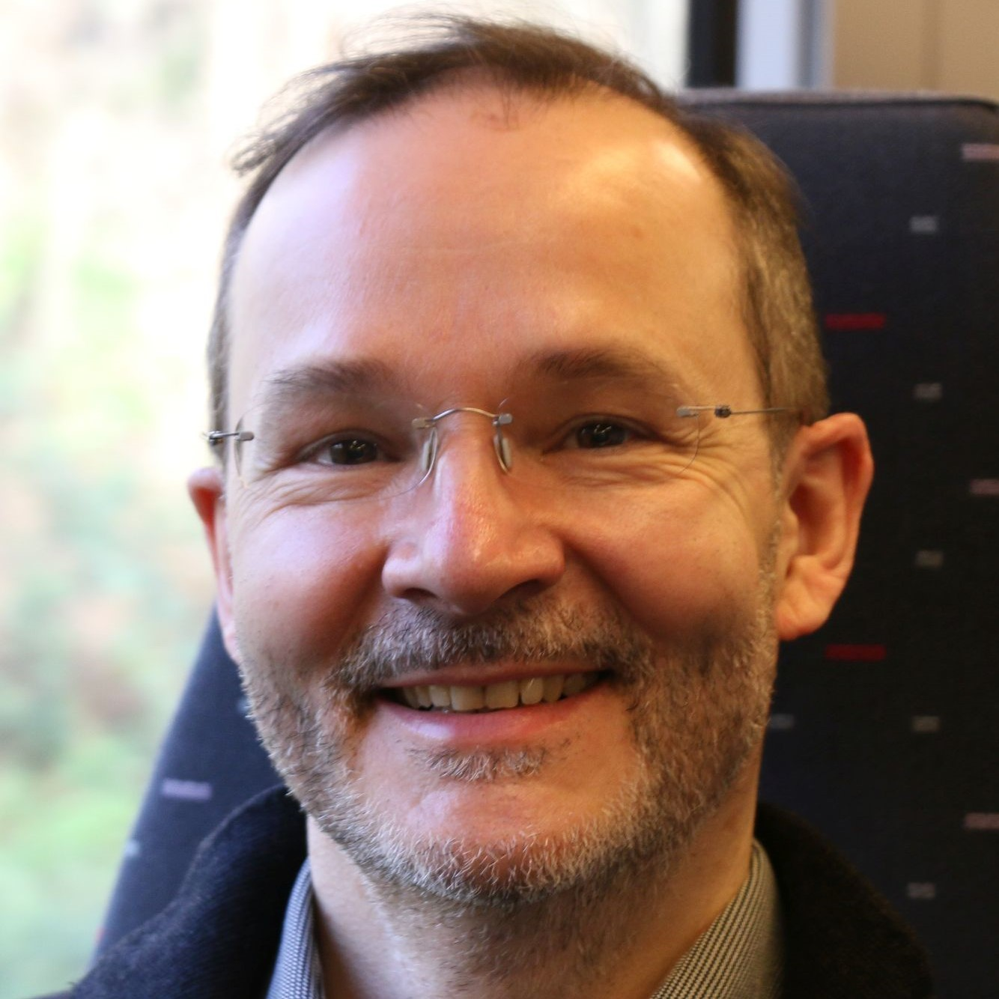
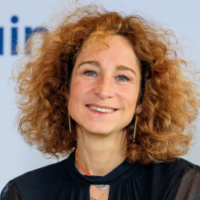
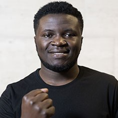
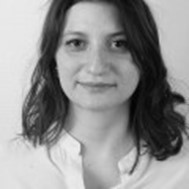
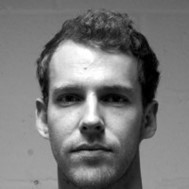
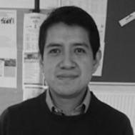
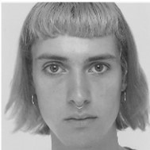

.. _team-reference:

**Our Team**
++++++++++++++

The GlobMig team consists of 6 promoters, 6 postdoc researchers and 11 PhD students. The promoters and senior members are:
Philippe Bocquier (Coordinator), Jean-Yves Carlier, Siegfried Nijssen, Sylvie Saroléa,
Pierre Schaus and Frédéric Docquier (external members since January 2020).

.. |br| raw:: html

    

|br|

Demographic Team
=================

`Philippe Bocquier <https://uclouvain.be/fr/repertoires/philippe.bocquier>`_
----------------------------------------------------------------------------------

Philippe Bocquier holds an MA and a PhD in demography from Sorbonne University in Paris, as well as an MSc in Statistics from the London School of Economics and Political Science. 
From 1988 to 2008, he held various research positions for the French Institut de recherche pour le développement, being posted in Senegal, Mali, and Kenya. 
In 2008-2010, he was a lecturer at the University of the Witwatersrand, South Africa, where he holds now an Honorary Senior Researcher position. 
He has a long experience in longitudinal analysis, using both retrospective survey data and health and demographic surveillance systems. 
His research interests range from urban projections to demographic transition and from urban integration to entry into adulthood. 
His current research focus is on migration and health interrelationships.

`Publications <https://dial.uclouvain.be/pr/boreal/fr/search/site/bocquier?f%5B0%5D=sm_creator%3ABocquier%2C%20Philippe>`_

|br|

.. image:: _static/members/ashira.jpg
    :width: 200
    :alt: Ashira Menashe-Oren
    :align: left

`Ashira Menashe-Oren <https://uclouvain.be/fr/repertoires/ashira.menashe-oren>`_
-------------------------------------------------------------------------------------

Ashira Menashe-Oren is a post-doctoral researcher at Université catholique de Louvain. She holds a PhD in demography from the Hebrew University of Jerusalem. 
Her research focuses on the relationship between population dynamics and development, and she has particularly worked on rural-urban population composition and migration in sub-Saharan Africa.

`Publications <https://dial.uclouvain.be/pr/boreal/fr/search/site/Menashe%20Oren?f%5B0%5D=sm_creator%3AMenashe%20Oren%2C%20Ashira>`_

|br|

|br|

.. image:: _static/members/nie.jpg
    :width: 200
    :alt: Wanli Nie
    :align: right

`Wanli Nie <https://wanlinie.weebly.com/>`_
----------------------------------------------------------------------------------

Wanli Nie joined the GLOBMIG project since July 2020 under the supervision of Philippe Bocquier. 
In 2021, she prepared the 1-year, 3-year and 5-year estimate of migration rates for 70 censuses in 30 countries in Asia and Africa, in both “UR” (urban-rural) and “COR” (capital-other urban-rural) approaches. 
Together with her promoter Professor Philippe Bocquier and Dr. Ashira Menashe-Oren, they encountered many practical issues during the estimation process as missing values, 
lack of consistency between censuses, identification of migrants, etc., but they were able to come up with acceptable solutions during the meetings. 
She presented their paper with preliminary results on the International Population Conference 2021 (online).   

`Publications <https://dial.uclouvain.be/pr/boreal/fr/search/site/Nie?f%5B0%5D=sm_creator%3ANie%2C%20Wanli>`_

|br|

|br|

Law Team
=========

.. image:: _static/members/carlier_c.jpg
    :width: 200
    :alt: Jean-Yves Carlier
    :align: left

`Jean-Yves Carlier <https://uclouvain.be/fr/repertoires/jean-yves.carlier>`_
----------------------------------------------------------------------------------

Jean-Yves CARLIER is professor in Belgium at the Université catholique de Louvain (UCLouvain), the Université de Liège and the Facultés universitaires Saint Louis. He is also Barrister (avocat). He is or was visiting professor in different 
universities (Paris 2 (Panthéon-Assas), Caen, Strasbourg, Aix-Marseille, Montréal, Den Hague Academy of International Law, Rabat, Tunis, Ouagadougou, Cotonou, Bujumbura, Bukavu).
He teaches International Private Law, European Law and Human Rights. 

`Publications <https://dial.uclouvain.be/pr/boreal/fr/search/site/Carlier?f%5B0%5D=sm_creator%3ACarlier%2C%20Jean-Yves>`_

|br|

|br|

`Sylvie Sarolea <https://uclouvain.be/fr/repertoires/sylvie.sarolea>`_
----------------------------------------------------------------------------------

Sylvie Sarolea, professor at UCLouvain, teaches refugee law, international immigration law, international private law and human rights. 
Sylvie Sarolea is also a lawyer at the Bar of Walloon Brabant. She founded the EDEM, which she has been coordinating since 2011. She is a member of the Odysseus academic network. 
She coordinates and/or participates in several interdisciplinary research projects (LIMA, GLOBMIG, VULNER, ISEMI...). 
She is involved in privileged partnerships in Canada, Morocco and South Kivu.

`Publications <https://dial.uclouvain.be/pr/boreal/search/site/sarolea?f%5B0%5D=sm_creator%3ASarolea%2C%20Sylvie&solrsort=ss_date%20desc>`_

|br|

.. image:: _static/members/gatta.jpg
    :width: 200
    :alt: Francesco Gatta
    :align: left

`Francesco Gatta <https://uclouvain.be/fr/repertoires/francesco.gatta>`_
---------------------------------------------------------------------------

Francesco Gatta is a researcher at the University of Milan. He has a double PhD in EU law (University of Padova and Leopold-Franzens- Universität Innsbruck, Austria). 
He was a Global College of Law Fellow during the fall of 2017.

`Publications <https://uclouvain.academia.edu/FrancescoLuigiGatta>`_

|br|

|br|

|br|

.. image:: _static/members/EFrasca_c.jpg
    :width: 200
    :alt: Eleonora Frasca
    :align: right

`Eleonora Frasca <https://uclouvain.be/fr/repertoires/eleonora.frasca>`_
------------------------------------------------------------------------------

Eleonora Frasca holds a Master's degree in Law (Faculty of Law of the University of Rome "Sapienza") and a Master of Science in Public Policy and Human Development 
(Maastricht Graduate School of Governance and United Nations University UNU-Merit) with a specialisation in migration studies.
She started a PhD in EU Migration Law in November 2018 under the supervision
of Professor Sylvie Sarolea in the context of the GLOBMIG project. Prof. Jean-Yves Carlier and
Prof. Fréderic Docquier are members of her *comité d’accompagnement*. Her PhD research is entitled
“The legal relevance of EU-Africa cooperation on migration”. In 2021, Eleonora has participated
to international seminars and conferences, both in-person and online and she has published articles
in peer-reviewed journals (in the European Journal of Human Rights, in the Queen Mary Law
Journal, and in the Italian Journal Costituzionalismo.it), several case notes and blog posts on a wide
range of topics related to EU Migration Law ranging from EU-third countries migration
cooperation, the European Commission’s New Pact on Migration and Asylum, human rights
violations at the EU external borders and the question of equal treatment of third-country nationals
residing in the EU.

`Publications <https://dial.uclouvain.be/pr/boreal/fr/search/site/Gatta?f%5B0%5D=sm_creator%3AFrasca%2C%20Eleonora>`_

|br|

`Brock Isaac Muhambya <https://uclouvain.be/fr/repertoires/brock.isaac>`_
------------------------------------------------------------------------------

Brock Isaac Muhambya, a civil rights militant and, lawyer, holds a master’s degree in International Law from the Université Catholique de Louvain (UCLouvain). 
Since 2012 he has been an active participant in La Lutte pour le Changement (LUCHA), a non-violent civil society movement in the Democratic Republic of the Congo. 
Since its inception, this non-partisan movement has worked for social justice and democracy and combatted extractivism, repression, and corruption. 
From his foundation, Brock Isaac Muhambya has worked in different areas, although owing to his legal training he has focused on the defence of detained militants. 
He has also played a key role in bringing the movement’s cause to international attention.

`Publications <https://dial.uclouvain.be/memoire/ucl/fr/search/site/sm_creator%3A%22Isaac%20Muhambya%2C%20Brock%22>`_

|br|

`Alfred Ombeni Musimwa <https://uclouvain.be/fr/repertoires/alfred.ombeni>`_
--------------------------------------------------------------------------------

Alfred Ombeni Musimwa is a PhD researcher in Legal Sciences, Faculty of Law and Criminology at Université Catholique de Louvain (UCLouvain).

|br|

Economic Team
===============

.. image:: _static/members/docquier.jpg
    :width: 200
    :alt: Frédéric Docquier
    :align: left

`Frédéric Docquier <https://liser.elsevierpure.com/fr/persons/fr%C3%A9d%C3%A9ric-docquier>`_
--------------------------------------------------------------------------------------------------

Frédéric Docquier is Research Program Leader (on Crossing Borders) at the Luxembourg Institute of Socio-Economic Research. 
He was previously Professor of Economics at the Université catholique de Louvain, and Research Associate at the National Fund for Economic Research. 
He holds a PhD in Economics from the University of Aix-Marseille 2. His research interests are in international migration and quantitative development/growth theory. 
He acted as a ST Consultant for the World Bank and as an external expert for the United Nations (UNESCO and High-Level Panel on the post-2015 Development Agenda) and Agence Française de Développement. 
He served as Research Director of IRES at UCLouvain between 2008 and 2012. 
He edited four books and published articles in Journal of Economic Theory, Journal of Economic Literature, Economic Journal, 
Journal of Economic Growth, Journal of Economic Geography, Journal of International Economics, Journal of Development Economics, and many other journals.

`Publications <https://dial.uclouvain.be/pr/boreal/fr/search/site/Docquier?f%5B0%5D=sm_creator%3ADocquier%2C%20Fr%C3%A9d%C3%A9ric>`_

|br|

`Stefanija Veljanoska <https://crem.univ-rennes.fr/interlocuteurs/stefanija-veljanoska>`_
--------------------------------------------------------------------------------------------------

Stefanija VELJANOSKA is a former ARC postdoc researcher. She is now assistant professor at the University of Rennes 1.

`Publications <https://www.researchgate.net/profile/Stefanija-Veljanoska>`_

|br|

|br|

|br|

|br|

`Ehui Adovor <https://uclouvain.be/en/directories/ehui.adovor>`_
--------------------------------------------------------------------------------------------------

Ehui Adovor is a PhD student at UCLouvain.

`Publications <https://dial.uclouvain.be/pr/boreal/fr/search/site/adovor?f%5B0%5D=sm_creator%3AAdovor%2C%20Ehui>`_

|br|

|br|

|br|

|br|

`Yannik Schenck <https://uclouvain.be/fr/repertoires/yannik.schenk>`_
--------------------------------------------------------------------------------------------------

Yannik Schenk is a PhD student at UCLouvain.

|br|

|br|

|br|

|br|

`Hendrik Scheewel <https://uclouvain.be/fr/repertoires/hendrik.scheewel>`_
--------------------------------------------------------------------------------------------------

Hendrik Scheewel is a former PhD student at UCLouvain. 

|br|

Computer Science Team
======================

.. image:: _static/members/schaus.jpg
    :width: 200
    :alt: Pierre Schaus
    :align: left

`Pierre Schaus <https://www.info.ucl.ac.be/~pschaus/>`_
----------------------------------------------------------------------------------

Pierre Schaus obtained his Ph.D. from the UCLouvain University in 2009. He spent 5 months at Brown University. 
Then he joined the Dynadec startup to work on Comet during two years before working two more years at N-SIDE. He is now professor of computer science at UCLouvain in the ICTeam Institute.

`Publications <https://dial.uclouvain.be/pr/boreal/fr/search/site/Schaus?f%5B0%5D=sm_creator%3ASchaus%2C%20Pierre>`_

|br|

|br|

.. image:: _static/members/nijssen.jpg
    :width: 200
    :alt: Siegfried Nijssen
    :align: right

`Siegfried Nijssen <https://www.info.ucl.ac.be/~snijssen/>`_
----------------------------------------------------------------------------------

Siegfried Nijssen is an assistant professor of data mining and artificial intelligence at the Université catholique de Louvain (UCLouvain) in Belgium. 
His research aims to make data analysis simpler for both end-users and programmers; it studies intersections between pattern mining, exploratory data analysis, and programming paradigms in Artificial Intelligence, 
such as constraint programming and probabilistic programming. He has developed techniques for analysing a wide range of data types, including graphs, networks and multi-relational data.

`Publications <https://dial.uclouvain.be/pr/boreal/fr/search/site/Nijssen?f%5B0%5D=sm_creator%3ANijssen%2C%20Siegfried>`_

|br|

.. image:: _static/members/golenvaux.jpeg
    :width: 200
    :alt: Nicolas Golenvaux
    :align: left

`Nicolas Golenvaux <https://uclouvain.be/fr/repertoires/nicolas.golenvaux>`_
----------------------------------------------------------------------------------

Nicolas Golenvaux started a PhD in September 2020 under the supervision of Pierre Schaus and Siegfried Nijssens at UCLouvain. 
Nicolas is working on analyzing mobility data from social networks such as Facebook and working working on infoviz optimization techniques for visualizing migration flow data on map and avoid cluttering. 

`Publications <https://dial.uclouvain.be/pr/boreal/fr/search/site/Golenvaux?f%5B0%5D=sm_creator%3AGolenvaux%2C%20Nicolas>`_

|br|

.. image:: _static/members/bae.jpg
    :width: 200
    :alt: Juhee Bae
    :align: right

Juhee Bae
----------------------------------------------------------------------------------

|br|

|br|

|br|

|br|

|br|

|br|

`Erick Cuenca <https://erickedu85.github.io/>`_
----------------------------------------------------------------------------------

Since Dec. 2019, Erick Cuenca has been an associate professor at Yachay Tech University, Ecuador. 
Erick is a member of the Computer Science department. Erick focuses his research on data visualization. 
He is especially interested in getting insight from time-space-oriented data or graph model information. 
In 2019, Erick was a postdoctoral researcher at UCLouvain University, Belgium. Erick’s research focused on proposing several approaches to understand the temporal and spatial aspects of the data. 
He was a member of the INGI department at the ICTEAM institute. In 2018, Erick defended his Ph.D. thesis at the University of Montpellier, France, where he was a member of the ADVANSE team at the LIRMM laboratory. 
His thesis work focuses on dynamic and complex data modeled by time series and graphs, respectively.

|br|

.. image:: _static/members/derval.png
    :width: 200
    :alt: Guillaume Derval
    :align: right

`Guillaume Derval <https://www.montefiore.uliege.be/cms/c_3482915/en/montefiore-directory?uid=u239143>`_
-------------------------------------------------------------------------------------------------------------

Guillaume Derval obtained his Ph.D. from the UCLouvain University in 2021. He is now assistant professor at University of Liège.

`Publications <https://dial.uclouvain.be/pr/boreal/fr/search/site/Derval?f%5B0%5D=sm_creator%3ADerval%2C%20Guillaume>`_

|br|

|br|

|br|

|br|

.. image:: _static/members/Aoga.jpg
    :width: 200
    :alt: John Aoga
    :align: left
John Aoga
----------------------------------------------------------------------------------

John Aoga obtained a Ph.D. from the UCLouvain University in 2019 in the field of Data Mining and Constraint Programming.

`Publications <https://www.researchgate.net/profile/John-Aoga>`_

|br|

|br|

|br|

|br|

`Lucìa Mattenet <https://uclouvain.be/fr/repertoires/lucia.mattenet>`_
----------------------------------------------------------------------------------

Lucìa Mattenet is a PhD student at the UCLouvain University.

`Publications <https://dial.uclouvain.be/pr/boreal/fr/search/site/Mattenet?f%5B0%5D=sm_creator%3AMattenet%2C%20Luc%C3%ADa>`_

|br|

|br|

|br|

|br|

`Harold Kiossou <https://uclouvain.be/fr/repertoires/harold.kiossou>`_
----------------------------------------------------------------------------------

Harold Kiossou is a PhD student at the UCLouvain University. He studies in the fields of artificial intelligence and data science.

`Publications <https://www.researchgate.net/profile/Harold-Kiossou>`_

|br|

`Alexandre Dubray <https://uclouvain.be/fr/repertoires/alexandre.dubray>`_
----------------------------------------------------------------------------------

Alexandre Dubray is a PhD student and a teaching assistant at the UCLouvain University.

|br|
