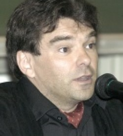
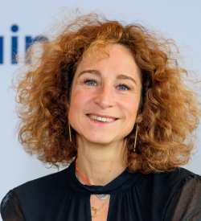
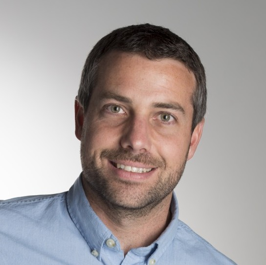

.. _team-reference:

Our Team
++++++++++

`EDEM <https://uclouvain.be/fr/instituts-recherche/juri/cedie/edem.html>`_ is involved in the GLOBMIG Project. The researchers of EDEM working on this project are Francesco Gatta, Eleonora Frasca, Jean-Yves Carlier and Sylvie Sarolea. 
We will interact with the promotor Frédéric Docquier (coordinator), ESPO/IRES/IMMAQ, Chercheur Qualifié at FSR-FNRS and Professor of Economics at UCLouvain, 
as well as Philippe Bocquier, ESPO/DEMO, Professor of Demography at UCLouvain, and Pierre Schaus, (SST/)EPL/ICTM, Professor of Computer Science at UCLouvain. 

.. |br| raw:: html

    

|br|

.. image:: _static/gatta.jpg
    :width: 200
    :alt: Francesco Gatta
    :align: left

`Francesco Gatta <https://uclouvain.be/fr/repertoires/francesco.gatta>`_
---------------------------------------------------------------------------

Francesco Gatta est chercheur à l’Université de Milan. Il a un double PhD en droit de l’Union européenne (Université de Padoue et Leopold-Franzens- Universität Innsbruck, Austria). 
Il fut Global College of Law Fellow durant l'automne 2017.

|br|

|br|

|br|

.. image:: _static/EFrasca.jpg
    :width: 200
    :alt: Eleonora Frasca
    :align: right

`Eleonora Frasca <https://uclouvain.be/fr/repertoires/eleonora.frasca>`_
---------------------------------------------------------------------------

Eleonora Frasca est titulaire d’un Master en droit (Faculté de droit de l’Université de Rome “Sapienza”) et d’un Master of Science in Public Policy and Human Development 
(Maastricht Graduate School of Governance et United Nations University UNU-Merit) avec une spécialisation en études migratoires. 
Elle réalise un Phd sur les relations entre l'Union européenne et les pays africains en matière migratoire. 
Elle les étudie au travers du prisme institutionnel et de la forme des actes adoptés. Cette recherche participe du projet interdisciplinaire GLOBMIG.

`Publications <https://dial.uclouvain.be/pr/boreal/fr/search/site/Gatta?f%5B0%5D=sm_creator%3AFrasca%2C%20Eleonora>`_

|br|

`Jean-Yves Carlier <https://uclouvain.be/fr/repertoires/jean-yves.carlier>`_
----------------------------------------------------------------------------------

Jean-Yves Carlier est professeur à l’Université catholique de Louvain, à l’Université de Liège, aux Facultés universitaires Saint Louis et avocat au barreau de Nivelles. 
Il est ou a été professeur invité dans différentes universités (Paris 2, Genève, Caen, Aix, Montréal, Ouagadougou, Cotonou, Bujumbura).

`Publications <https://dial.uclouvain.be/pr/boreal/fr/search/site/Carlier?f%5B0%5D=sm_creator%3ACarlier%2C%20Jean-Yves>`_

|br|

|br|

`Sylvie Sarolea <https://uclouvain.be/fr/repertoires/sylvie.sarolea>`_
----------------------------------------------------------------------------------

Sylvie Sarolea, professeure à l’UCLouvain, enseigne le droit des réfugiés, le droit international de l’immigration, le droit international privé et les droits de l’homme. 
Sylvie Sarolea est aussi avocate au barreau du Brabant wallon. Elle a fondé l’EDEM qu'elle coordonne depuis 2011. Elle est membre du réseau académique Odysseus. 
Elle coordonne et/ou participe à plusieurs projets de recherche interdisciplinaires (LIMA, GLOBMIG, VULNER, ISEMI…). 
Elle participe à des partenariats privilégiés au Canada, au Maroc et au Sud-Kivu.

`Publications <https://dial.uclouvain.be/pr/boreal/search/site/sarolea?f%5B0%5D=sm_creator%3ASarolea%2C%20Sylvie&solrsort=ss_date%20desc>`_

|br|

.. image:: _static/docquier.jpg
    :width: 200
    :alt: Frédéric Docquier
    :align: left

`Frédéric Docquier <https://liser.elsevierpure.com/fr/persons/fr%C3%A9d%C3%A9ric-docquier>`_
--------------------------------------------------------------------------------------------------

Frédéric Docquier is Research Program Leader (on Crossing Borders) at the Luxembourg Institute of Socio-Economic Research. 
He was previously Professor of Economics at the Université catholique de Louvain, and Research Associate at the National Fund for Economic Research. 
He holds a PhD in Economics from the University of Aix-Marseille 2. His research interests are in international migration and quantitative development/growth theory. 
He acted as a ST Consultant for the World Bank and as an external expert for the United Nations (UNESCO and High-Level Panel on the post-2015 Development Agenda) and Agence Française de Développement. 
He served as Research Director of IRES at UCLouvain between 2008 and 2012. 
He edited four books and published articles in Journal of Economic Theory, Journal of Economic Literature, Economic Journal, 
Journal of Economic Growth, Journal of Economic Geography, Journal of International Economics, Journal of Development Economics, and many other journals.

`Publications <https://dial.uclouvain.be/pr/boreal/fr/search/site/Docquier?f%5B0%5D=sm_creator%3ADocquier%2C%20Fr%C3%A9d%C3%A9ric>`_

|br|

.. image:: _static/bocquier.jpg
    :width: 200
    :alt: Philippe Bocquier
    :align: right

`Philippe Bocquier <https://uclouvain.be/fr/repertoires/philippe.bocquier>`_
----------------------------------------------------------------------------------

Philippe Bocquier holds an MA and a PhD in demography from Sorbonne University in Paris, as well as an MSc in Statistics from the London School of Economics and Political Science. 
From 1988 to 2008, he held various research positions for the French Institut de recherche pour le développement, being posted in Senegal, Mali, and Kenya. 
In 2008-2010, he was a lecturer at the University of the Witwatersrand, South Africa, where he holds now an Honorary Senior Researcher position. 
He has a long experience in longitudinal analysis, using both retrospective survey data and health and demographic surveillance systems. 
His research interests range from urban projections to demographic transition and from urban integration to entry into adulthood. 
His current research focus is on migration and health interrelationships.

`Publications <https://dial.uclouvain.be/pr/boreal/fr/search/site/bocquier?f%5B0%5D=sm_creator%3ABocquier%2C%20Philippe>`_

|br|

`Pierre Schaus <https://uclouvain.be/fr/repertoires/pierre.schaus>`_
----------------------------------------------------------------------------------

Pierre Schaus obtained his Ph.D. from the UCLouvain University in 2009. He spent 5 months at Brown University. 
Then he joined the Dynadec startup to work on Comet during two years before working two more years at N-SIDE. He is now professor of computer science at UCLouvain in the ICTeam Institute.

`Publications <https://dial.uclouvain.be/pr/boreal/fr/search/site/Schaus?f%5B0%5D=sm_creator%3ASchaus%2C%20Pierre>`_